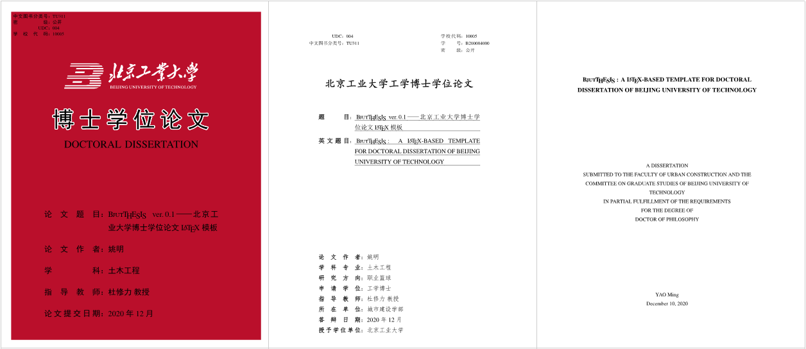
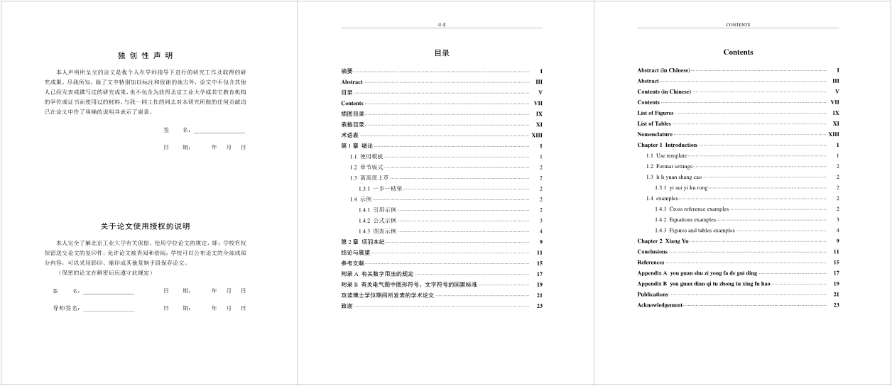
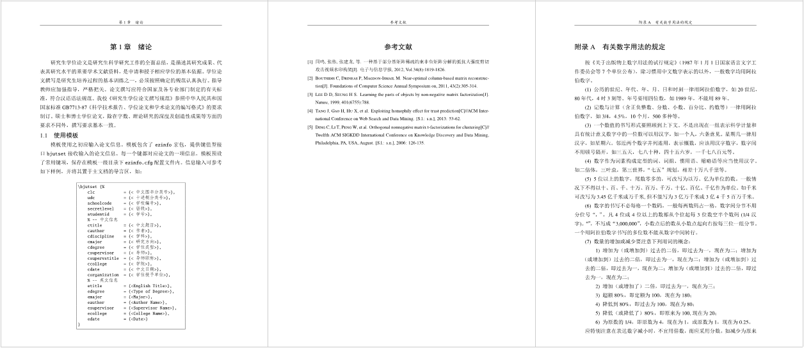

# 

## 欢迎使用北京工业大学博士学位论文模板

`BjutTHESIS` 为北京工业大学**博士**学位论文 **<u>非官方</u>** `LaTeX` 模板，制作依据为北京工业大学研究生院发布的 [《北京工业大学研究生学位论文撰写规范（2017修订）》](http://graduate.bjut.edu.cn/zyxw/fqrz/201949/15547925280356791_1.html)。

## 模板内容

模板的格式细节极大程度地遵循了撰写规范。

与硕士学位论文不同，工大博士学位论文要求提供双语的扉页、摘要、目录、图题和表题，模板对此予以实现，[样例文档](main.pdf) 提供了使用示例和效果预览。







## 使用环境

本模板目前支持 `XeLaTeX` 引擎，字符编码仅支持 `UTF-8`。

目前测试通过的平台：

-  `Windows 7` /`Windows 10` ，`TeXLive` ~~`2018`~~/~~`2019`~~/`2020`;
-  ~~`macOS` `10.13.6`，`MacTeX` `2019`~~;
-  `macOS` `10.15.6`，`MacTeX` `2020`.

## 更新日志

- `@20201210`：
  
  - 修复双语图题、表题在指定宽度时英文标题无法居中的 [bug](https://gitlab.com/axelsommerfeldt/caption/-/issues/106)，需更新 `caption`、`bicaption` 宏包至修复后版本（如 [CTAN Release 2020-10-26](https://gitlab.com/axelsommerfeldt/caption/-/releases/CTAN_2020-10-26) 或更新版本），或从宏包作者 Axel Sommerfeldt 的 [gitlab仓库](https://gitlab.com/axelsommerfeldt/caption/-/tree/master/tex) 下载 `*.sty` 文件放置在工作目录或覆盖旧版宏包；
  
  - 添加图、表和术语目录，注：此类目录撰写规范并未要求，如无需，编译前删除相关命令即可；
  
  - 更新参考文献作者姓名为 `\textsc` 格式；
  
  - 增加 `where` 环境，方便添加符合撰写规范要求的公式变量注释。用法及效果如下：
  
    ```latex
    \begin{equation}
        E = mc^2
    \end{equation}
    \begin{where}[式中：]
        $E$ & 能量； \\
        $m$ & 质量； \\
        $c$ & 光速。光速指光在真空中的速率，是一个物理常数。光速指光在真空中的速率。
    \end{where}
    ```
    
  
  
  
- `@20200910`：
  
  - `macOS 10.15` 下需升级 `CTeX` 宏集至 `2.5.4` 或更新版本，以确保字体设置通过编译。
  - 修复 `macOS` 下扉页中文标题无法自动换行的问题。
  
- `@20191024`：

  - 加入 `macOS` 适配。

## 致谢

* 感谢 [`TeX`](http://www.ctan.org) 的开发人员和贡献者，以及 [`CTeX`](http://www.ctex.org/HomePage) 提供的 `LaTeX` 中文支持。
* 感谢 [部分](http://yzlab.net/BjutThsis.html) 早期的工作为模板制作提供了一定参考。

## 声明

模板中使用的校徽图片及校徽组合Logo的版权归北京工业大学所有。

其他部分使用 [MIT 授权协议](LICENSE) ，由于违犯协议而引起的任何纠纷争端均与本模板作者无关。

